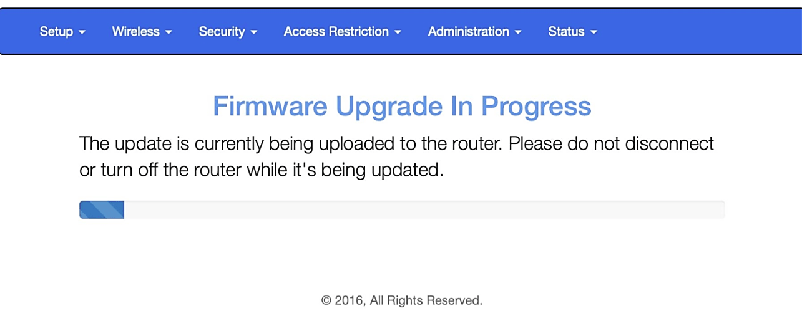

# Wifiphisher

## Introduzione

Wifiphisher è un potente strumento Python per condurre attacchi di phishing su reti Wi-Fi. Sfruttando ingegneria sociale e tecniche di spoofing, induce gli utenti a fornire credenziali o a compiere azioni che compromettono la sicurezza della rete.

## Funzionamento di Wifiphisher

Il funzionamento di Wifiphisher si basa su tre fasi principali:

1. **Disconnessione del target**: Wifiphisher inizia inviando pacchetti di deautenticazione al client target e all'AP legittimo. Questi pacchetti, causano la disconnessione forzata del client dalla rete originale.
Per poter effettuare questa operazione è necessario che la scheda di rete dell'attacante supporti la monitor mode e la packet injection.
2. **Creazione di un AP malevolo**: Dopo aver disconnesso il client, Wifiphisher crea un access point malevolo con lo stesso SSID dell'AP legittimo. Il client, non riuscendo a connettersi alla propria rete a causa dei pacchetti di deautenticazione, si collega inconsapevolmente all'AP malevolo.
3. **Phishing tramite pagina web**: Una volta connesso all'AP malevolo, il client viene reindirizzato a una pagina web di phishing che può assumere diverse forme a seconda dell'attacco specifico. Queste pagine sono progettate per sembrare legittime e convincere l'utente a fornire informazioni sensibili. Le pagine possono essere create ad-hoc per l'attacco oppure è possibile sfruttare quelle già presenti online create da altri utenti.

_Figura 1: Vignetta che rappresenta il funzionamento dell'attacco_

## Tipologie di attacco

Il tool include diverse tecniche di attacco:

1. **Firmware Update Page**: Questo attacco presenta all'utente una pagina che simula un aggiornamento del firmware del router. L'utente viene invitato a inserire la password del Wi-Fi per procedere con l'aggiornamento.
2. **OAuth Login Page**: Questo attacco reindirizza l'utente a una pagina di login che simula un servizio OAuth comune (ad esempio, Google, Facebook) per ottenere le credenziali di accesso.
3. **Browser Plugin Update**: In questo scenario, l'utente vede una pagina che gli comunica la necessità di aggiornare un plugin del browser. L'utente viene quindi indotto a scaricare e installare un malware.
4. **Network Manager Connect**: Questa tecnica presenta all'utente una pagina che simula l'interfaccia di connessione del network manager del sistema operativo, richiedendo nuovamente la password del Wi-Fi per connettersi alla rete.

## Tecnica Firmware Update Page

Questa tecnica sfrutta la fiducia che gli utenti ripongono nelle notifiche di aggiornamento del firmware dei loro router. Al termine della tecnica l'utente non esperto non si sentirà di aver subito una truffa ma,al contrario, sarà felice di aver aggiornato il firmware del suo modem.

### Fasi dell'attacco in dettaglio

1. **Selezione del target**: L'attaccante sceglie un punto di accesso Wi-Fi con un'alta probabilità di avere molti utenti connessi. Il tool utilizza strumenti come `airodump-ng` per monitorare le reti wireless vicine e identificare quelle con più client.

2. **Disconnessione del target**: Wifiphisher invia pacchetti di deautenticazione ai client connessi alla rete target. Questo forza i client a disconnettersi dal punto di accesso legittimo, creando un'interruzione temporanea del servizio che li spinge a cercare di riconnettersi.

3. **Creazione dell'AP malevolo**: Simultaneamente alla disconnessione, Wifiphisher crea un AP con lo stesso SSID della rete legittima il quale può anche utilizzare un canale differente per evitare interferenze con il punto di accesso originale.

4. **Connessione del client all'AP**: I client disconnessi, alla ricerca di riconnettersi alla loro rete, vedono il rogue AP con lo stesso SSID e si connettono ad esso. Poiché i client non percepiscono differenze evidenti, la connessione avviene senza ulteriori sospetti.

5. **Reindirizzamento alla pagina di phishing**: Una volta connessi, i client vengono automaticamente reindirizzati a una pagina web che simula l'interfaccia di aggiornamento del firmware del loro router (Figura 2). Questo reindirizzamento è ottenuto manipolando le impostazioni del server DHCP e DNS all'interno del rogue AP.

_Figura 2: Un esempio della pagina di phishing_

6. **Raccolta delle credenziali**: La pagina di phishing chiede agli utenti di inserire la password del Wi-Fi per procedere con l'aggiornamento del firmware. Quando l'utente inserisce la password, questa viene trasmessa all'attaccante. Dopo che l'attaccante ha ottenuto le informazioni, l'utente continuerà a vedere una barra di progressione che gli darà l'illusione di star effettivamente facendo l'aggiornmento software (Figura 3).

_Figura 3: Un esempio della barra di progressione_

7. **Ripristino situazione precedente**: Una volta ottenuta la password l'attaccante spegnerà l'AP malevolo e l'utente potrà tornare a connettersi alla propria rete wifi legittima come se nulla fosse.

## Modello MITRE ATT&CK

In riferimento al modello MITRE ATT&CK, la tecnica del Firmware Update Page può essere classificata sotto diverse categorie di tattiche e tecniche.

- **Tattica: Initial Access**: L'attacco inizia con l'accesso iniziale alla rete della vittima.
  - **Tecnica: Drive-by Compromise**: L'utente è indotto a interagire con una pagina web maligna.
- **Tattica: Credential Access**: L'obiettivo principale è ottenere le credenziali dell'utente.
  - **Tecnica: Input Capture**: La pagina di phishing cattura direttamente le credenziali inserite dall'utente.

## Prevenzione

Per proteggersi contro attacchi di questo tipo, è fondamentale educare correttamente gli utenti affinchè non vengano ingannati.

## Conclusioni

Wifiphisher rappresenta uno strumento potente per dimostrare le vulnerabilità delle reti Wi-Fi attraverso tecniche di ingegneria sociale. La tecnica del Firmware Update Page evidenzia come l'attaccante possa sfruttare la fiducia dell'utente in contesti apparentemente legittimi per ottenere credenziali di accesso sensibili. Comprendere il funzionamento di queste tecniche e adottare adeguate contromisure è essenziale per proteggere le reti wireless da attacchi di phishing e altre forme di compromissione. Educare gli utenti, mantenere aggiornati i dispositivi e implementare protocolli di sicurezza avanzati sono passi fondamentali per mitigare i rischi associati a questi attacchi.

## Fonti
[https://github.com/wifiphisher/wifiphisher](https://github.com/wifiphisher/wifiphisher)
