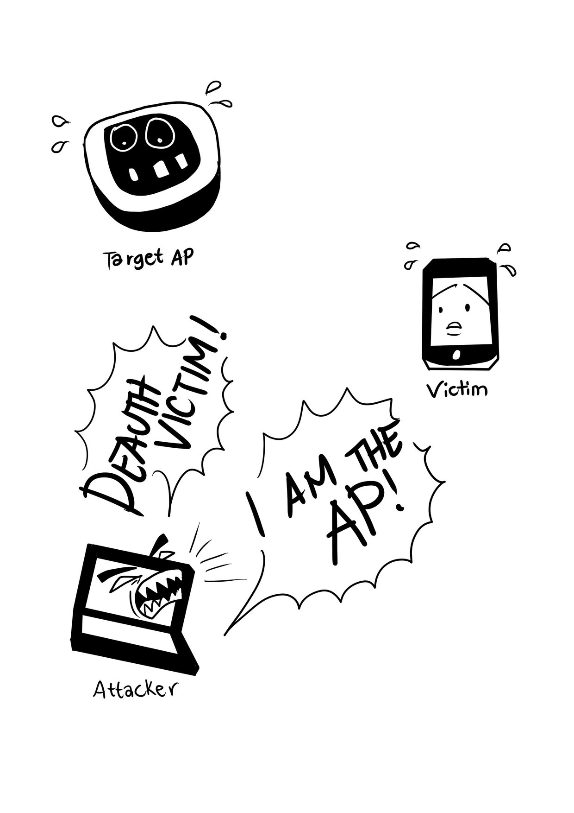
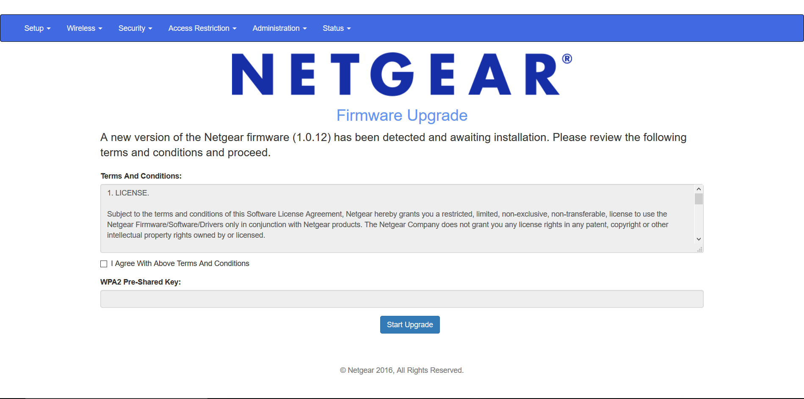
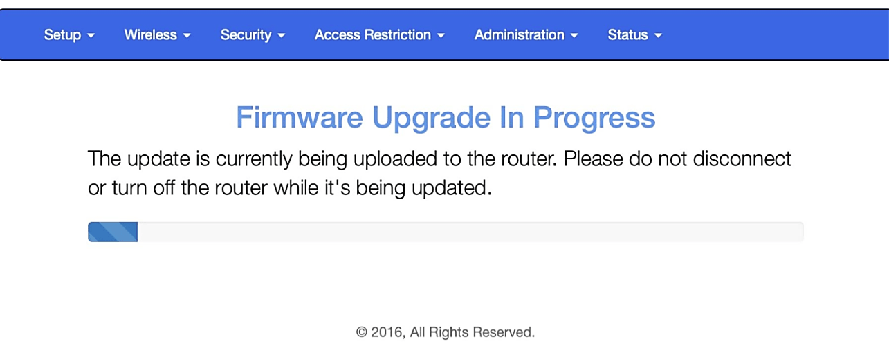

# **Wifiphisher**

## Introduzione

Wifiphisher è un potente strumento per condurre attacchi di phishing su reti Wi-Fi. Sfruttando ingegneria sociale e tecniche di spoofing, induce gli utenti a fornire credenziali o a compiere azioni che compromettono la loro sicurezza.

## Funzionamento di Wifiphisher

Il funzionamento di Wifiphisher si basa su tre fasi principali:

1. **Disconnessione del target**: Wifiphisher inizia inviando pacchetti di deautenticazione al client target e all'access point (AP) legittimo. Questi pacchetti, causano la disconnessione forzata del client dalla rete originale.
Per poter effettuare questa operazione, quindi, è necessario che la scheda di rete dell'attacante supporti sia la monitor mode, in modo da scansionare le reti wireless nelle vicinanze, sia la packet injection, così da inviare i pacchetti di deautenticazione.
2. **Creazione di un AP malevolo**: Dopo aver disconnesso il client, Wifiphisher crea un access point malevolo con lo stesso SSID dell'AP legittimo. Il client, non riuscendo a connettersi alla propria rete a causa dei pacchetti di deautenticazione, si collega inconsapevolmente all'AP malevolo.
3. **Phishing tramite pagina web**: Una volta connesso all'AP malevolo, il client viene reindirizzato a una pagina web di phishing che può assumere diverse forme a seconda dell'attacco specifico. Queste pagine sono progettate per sembrare vere e convincere l'utente a fornire informazioni sensibili.

_Figura 1: Vignetta che rappresenta il funzionamento dell'attacco_

## Tipologie di attacco

Il tool include diverse tecniche di attacco:

1. **Firmware Update Page**: Questo attacco presenta all'utente una pagina che simula un aggiornamento del firmware del router. L'utente viene invitato a inserire la password del Wi-Fi per procedere con l'aggiornamento.
2. **OAuth Login Page**: Questa tecnica reindirizza l'utente a una pagina di login che simula un servizio OAuth (ad esempio: Google, Facebook...) per ottenere le credenziali di accesso.
3. **Browser Plugin Update**: In questo caso, l'utente vede una pagina che gli comunica la necessità di aggiornare un plugin del browser. L'utente viene quindi indotto a scaricare e installare un malware.
4. **Network Manager Connect**: Questo attacco presenta all'utente una pagina che simula l'interfaccia di connessione del sistema operativo, richiedendo nuovamente la password del Wi-Fi per connettersi alla rete.

## Tecnica Firmware Update Page

Entriamo nello specifico della prima tecnica: Firmware Update Page, la quale sfrutta la fiducia che gli utenti ripongono nelle notifiche di aggiornamento del firmware dei loro router. Al termine dell'attacco, l'utente non esperto, non si sentirà ingannato ma, al contrario, sarà felice perchè crederà di aver aggiornato il firmware del suo modem.

### Fasi dell'attacco in dettaglio

1. **Selezione del target**: L'attaccante identifica un access point Wi-Fi con un elevato numero di utenti connessi, utilizzando strumenti come `airodump-ng` per monitorare le reti wireless vicine e individuare quelle con più client. In questa fase, è necessario che la scheda di rete sia configurata in modalità monitor.

2. **Disconnessione del target**: Wifiphisher invia pacchetti di deautenticazione ai client connessi alla rete target, forzandoli a disconnettersi dall'access point legittimo. Questa interruzione temporanea del servizio, induce gli utenti a cercare di riconnettersi. Per realizzare questa fase, la scheda di rete deve essere in grado di iniettare pacchetti sia all'AP che al client, in modo tale che si disconnettano.

3. **Creazione dell'AP malevolo**: Simultaneamente alla disconnessione, Wifiphisher crea un AP con lo stesso SSID della rete legittima; può anche utilizzare un canale differente per evitare interferenze con l'access point originale. Questa pratica è chiamata *evil twin*, ovvero gemello maligno.

4. **Connessione del client all'AP**: Quando l'utente nota che il proprio dispositivo è disconnesso, tenta di riconnettersi al Wi-Fi nelle impostazioni del dispositivo. Non trovando la rete legittima, l'utente vede solo la rete creata dall'AP maligno, poiché la rete legittima è stata nascosta in quanto considerata non funzionante.

5. **Reindirizzamento alla pagina di phishing**: Una volta connessi, i client vengono automaticamente reindirizzati a una pagina web che simula l'interfaccia di aggiornamento del firmware del loro router (Figura 2). Questo è possibile grazie a un web server e alla manipolazione dei server DHCP e DNS all'interno dell'AP maligno.

_Figura 2: Un esempio della pagina di phishing_

6. **Raccolta delle credenziali**: La pagina di phishing richiede agli utenti di inserire la password del Wi-Fi per procedere con l'aggiornamento del firmware. Per rendere la richiesta più credibile, vengono aggiunti svariati elementi come ad esempio finti termini e condizioni. La Figura 2 è solamente un esempio, in quanto la pgina di phishing è interamente personalizzabile tramite codice HTML, perciò è possibile creare un'interfaccia perfettamente identica a quella originale. Quando l'utente inserisce la password, questa viene trasmessa all'attaccante, contemporaneamente l'utente vede una pagina con una barra di progressione, creando l'illusione di un vero aggiornamento software (Figura 3).

_Figura 3: Un esempio della barra di progressione_

7. **Ripristino situazione precedente**: Dopo aver ottenuto la password, l'attaccante spegne l'AP malevolo. A questo punto l'utente crederà che l'aggiornamento software sia terminato e tenterà di riconnettersi al proprio Wi-Fi, che sarà nuovamente quello legittimo e funzionante.

## Modello MITRE ATT&CK

In riferimento al modello MITRE ATT&CK, l'attaco Firmware Update Page utilizza diverse categorie di tattiche e differenti tecniche, ecco le principali:

1. **Reconnaissance** :
   - Gather Victim Network Information (T1590): Wifiphisher utilizza strumenti come airodump-ng per monitorare le reti wireless vicine e raccogliere informazioni sulle reti e sui dispositivi connessi
2. **Resource Development**:
   - Compromise Infrastructure (T1584): L'attaccante prepara un punto di accesso malevolo, configurandolo per imitare la rete legittima (evil twin)
   - Deauthentication (T1587.002): Wifiphisher invia pacchetti di deautenticazione ai client connessi alla rete legittima, forzando la loro disconnessione
3. **Initial Access**:
   - Drive-by Compromise (T1189): Inducendo gli utenti a connettersi al punto di accesso malevolo, Wifiphisher ottiene l'accesso iniziale ai dispositivi target
4. **Execution**:
   - Command and Scripting Interpreter (T1059): L'esecuzione degli script necessari per inviare pacchetti di deautenticazione e reindirizzare il traffico dei client
   - Phishing (T1566): Gli utenti connessi all'AP malevolo vengono reindirizzati a una pagina di phishing che richiede l'inserimento delle credenziali Wi-Fi
5. **Credential Access**:
   - Credentials from Web Browsers (T1555.003): Tramite una pagina di phishing, Wifiphisher raccoglie le credenziali Wi-Fi inserite dagli utenti
   - Adversary-in-the-Middle (T1557): Creando un AP malevolo che imita la rete legittima, Wifiphisher esegue un attacco MitM, intercettando e manipolando il traffico tra i client e l'AP
6. **Command and Control**
   - Web Service (T1102): Wifiphisher ospita una pagina web fraudolenta su un server interno, utilizzato per presentare la falsa pagina di aggiornamento firmware
7. **Impact**:
   - Resource Hijacking (T1496): Forzando la disconnessione e inducendo gli utenti a connettersi al punto di accesso malevolo, l'attaccante dirotta temporaneamente le risorse di rete dell'utente
   - Network Denial of Service (T1498): La disconnessione dei client dalla rete legittima crea una condizione di Denial of Service temporanea, inducendo gli utenti a cercare altre reti disponibili

## Conclusioni

Questa demo mira a dimostrare quanto sia facile ingannare un utente poco informato. È importante conoscere il funzionamento dei dispositivi che usiamo quotidianamente, per esempio il modem per la navigazione su internet non chiederà la password del Wi-Fi per compiere un aggiornamento firmware.
Informare gli utenti dell'esistenza di tali tipologie di attacchi resta il modo migliore per evitare che questi si verifichino.

## Fonti
- [https://github.com/wifiphisher/wifiphisher](https://github.com/wifiphisher/wifiphisher)
- [https://attack.mitre.org/](https://attack.mitre.org/)

